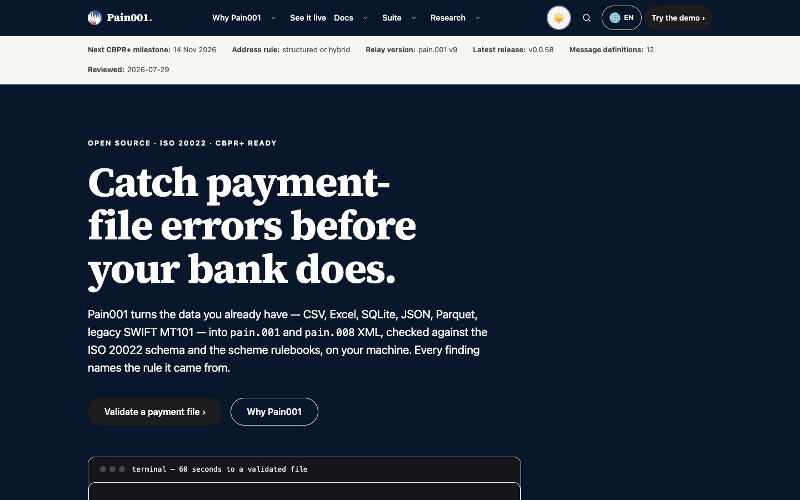

<!-- SPDX-FileCopyrightText: 2023-2026 Sebastien Rousseau -->
<!-- SPDX-License-Identifier: Apache-2.0 OR MIT -->
<!-- markdownlint-disable MD033 MD041 -->

<p align="center">
  
</p>

<h1 align="center">Pain001</h1>

<p align="center">
  The official website for the Pain001 open-source ISO 20022 payment initiation suite.
</p>

<p align="center">
  <a href="https://github.com/sebastienrousseau/pain001.github.io/actions/workflows/ci.yml"></a>
  <a href="https://github.com/sebastienrousseau/pain001.github.io/releases"></a>
  <a href="https://pain001.com/documentation/"></a>
  <a href="https://scorecard.dev/viewer/?uri=github.com/sebastienrousseau/pain001.github.io"></a>
  <a href="LICENSE"></a>
  <a href="https://static-site-generator.com/"></a>
</p>

<!-- markdownlint-enable MD033 MD041 -->

---

This repository builds <https://pain001.com>, the website for the
[Pain001](https://github.com/sebastienrousseau/pain001) open-source ISO 20022
payment initiation suite: core library, MCP server for AI agents, LSP server,
and the MT101 / Excel loaders. Its job is to convert a treasury engineer, an
integrator or an AI agent into an installed user, and to hand a regulated
buyer the evidence they need.

Built with the [Shokunin Static Site Generator (ssg)][00] **0.0.63 exactly**
and deployed to GitHub Pages by `ci.yml` from the same run that passed every
gate; the built tree is never committed. Cloudflare fronts the domain.



---

## Contents

<!-- The workspace README template groups these links under bold labels rather
     than headings, so that only the real sections appear in the table of
     contents. MD036 is suppressed for that block alone. -->
<!-- markdownlint-disable MD036 -->

**Getting started**

- [Install](#install) — clone and pin the generator; there is no installable artifact
- [Requirements](#requirements) — toolchain floor, platforms
- [Quick Start](#quick-start) — build the site and serve it locally

**The Pain001 ecosystem**

- [The Pain001 ecosystem](#the-pain001-ecosystem) — the five packages this site documents

**Reference**

- [Capabilities at a glance](#capabilities-at-a-glance) — what the built site contains
- [Ecosystem comparison](#ecosystem-comparison) — why the comparison lives in the library
- [Benchmarks](#benchmarks) — the performance budgets CI enforces
- [Features](#features) — repository layout and what each directory owns
- [Configuration](#configuration) — `ssg.toml`, the generator pin, the compliance declaration
- [Examples](#examples) — regenerating the site from a library release

**Operational**

- [When not to use Pain001](#when-not-to-use-pain001) — limitations
- [Development](#development) — build, post-build passes, gates, content editing
- [Security](#security) — reporting, hardening, supply chain
- [Documentation](#documentation) — all reference docs
- [Stability guarantees](#stability-guarantees) — SemVer axis, URL durability, toolchain discipline
- [License](#license)

<!-- markdownlint-enable MD036 -->

---

## Install

This repository produces a website, not an installable binary or library.
There is intentionally no system-wide `make install` for a Pages site.

```shell
git clone https://github.com/sebastienrousseau/pain001.github.io.git
cd pain001.github.io
cargo install ssg --locked --version 0.0.63
npm ci
```

Release archives of the built site are available from
[GitHub Releases](https://github.com/sebastienrousseau/pain001.github.io/releases)
for review or static hosting.

## Requirements

| Component | Floor | Enforced by |
| :--- | :--- | :--- |
| Shokunin SSG | 0.0.63 exactly | `SSG_VERSION` in `ci.yml`; the pin is the cache key |
| Node.js | 22 (24 also tested) | `engines` in `package.json`; the `node-matrix` job runs the unit tests on both |
| Python | 3.10 | generators and post-build passes |
| Chrome or Chromium | any current | layout, print, accessibility and Lighthouse gates |

The minimum may rise only in a patch release when a security fix, a parser
correctness fix, or a required generator feature demands it; the reason must
appear in `CHANGELOG.md` and a migration guide. No distro LTS compatibility is
claimed beyond those explicit floors.

## Quick Start

```shell
make build     # build, post-build repairs, publish to site/
make serve     # serve site/ on http://127.0.0.1:8099/
make verify    # reproduce the non-network CI gates
make deps      # audit npm advisories against the documented exceptions
```

## The Pain001 ecosystem

This site documents five packages, each with its own repository and release
cadence. The full map is in [`docs/ECOSYSTEM.md`](docs/ECOSYSTEM.md).

| Package | Role |
| :--- | :--- |
| `pain001` | Core library, CLI and REST API; the validation pipeline everything else calls |
| `pain001-mcp` | MCP server exposing the pipeline as tools for AI agents |
| `pain001-lsp` | Language server: diagnostics on payment files as you type |
| `pain001-loader-mt101` | SWIFT MT101 bridge onto the ISO 20022 pipeline |
| `pain001-loader-xlsx` | Excel on-ramp with the spreadsheet hazards handled |

## Capabilities at a glance

Measured on the current build.

| Surface | Detail |
| :--- | :--- |
| Pages | 668 built pages; 662 URLs in the sitemap |
| Locales | 34, with an hreflang cluster per localised page and RTL handling for 3 |
| Browser demo | `/try/` runs the `pain001` library itself in WebAssembly, same-origin, offline-capable; payment data never leaves the browser |
| Example corpus | 42 scenario pages with schema.org `Dataset` markup, downloadable inputs and expected output |
| Agent discovery | `llms.txt`, `llms-full.txt`, `agents.txt`, an MCP descriptor and a search index |
| Structured data | One JSON-LD graph per page: `Organization`, `WebSite`, `SoftwareApplication`, `FAQPage`, `Dataset` |

## Ecosystem comparison

Not applicable to this repository. A comparison against other ISO 20022
tooling is a claim about the library, not about its website, so it is
maintained with the library and published at
<https://pain001.com/competitors-comparison/>. Reproducing it here would
create a second copy to drift.

## Benchmarks

`scripts/perf_budget.mjs` gates every push. Five routes are measured under
both mobile and desktop Lighthouse profiles, and **all four Lighthouse
categories must score exactly 100** — performance, accessibility,
best practices and SEO — in addition to a transferred-byte ceiling.

| Route | Byte budget |
| :--- | ---: |
| `/` | 300 KiB |
| `/documentation/` | 300 KiB |
| `/compliance-toolkit/` | 300 KiB |
| `/example-corpus/` | 300 KiB |
| `/try/` | 400 KiB (before the WebAssembly runtime, which loads on intent) |

Timing metrics such as LCP are reported but not gated: a shared CI runner
makes them noisy, while scores and bytes are stable.

## Features

| Path | Purpose |
| :--- | :--- |
| `_posts/` | Page content (Markdown + front matter), the source of truth. Corpus scenario pages (`corpus-*.md`, `<locale>-corpus-*.md`) and message-spec pages are **generated**; edit the generator, not the page |
| `_layouts/` | HTML templates. `base` holds the head: the CSP meta, the security metas and the JSON-LD graph are declared once there and inherited by `index`, `page`, `contact` and `try` |
| `static/` | Copied verbatim into the output: the demo's ES modules (`js/`), the vendored Pyodide runtime and wheels (`pyodide/`), corpus files, schemas and samples (`corpus/`), the service worker, the vendored analytics beacon |
| `scripts/` | Generators, the post-build passes, translation tables and the validators CI runs |
| `tests/` | Node tests: demo input handling and the browser engine integration run against the vendored runtime |
| `site/` | The built site, produced by `build.sh`; ignored by git and uploaded by CI as the Pages artifact |
| `.github/workflows/` | `ci.yml` (build, every gate, and on `main` the Pages deploy), `regenerate.yml` (release-triggered regeneration, opens a PR), `codeql.yml` |

## Configuration

| File | What it controls |
| :--- | :--- |
| `ssg.toml` | Site name, description, language, base URL, and the content, template and output directories |
| `SSG_VERSION` in `.github/workflows/ci.yml` | The generator pin, single-sourced: it is both the install version and the binary cache key |
| `.compliance.yml` | Declared compliance tier, criticality and owner, per the workspace standard |
| `.pa11yci` | The URL list scanned at WCAG 2.2 AAA |
| `scripts/perf_budget.mjs` | Routes, Lighthouse profiles and byte budgets |

## Examples

Everything derived from the library is regenerated from the installed version:

```shell
python3 scripts/generate_try_samples.py                 # demo corpus samples
python3 scripts/generate_corpus_page.py <path-to-pain001-checkout>
python3 scripts/stamp_version.py <version>              # version literals on pages
./build.sh
```

`regenerate.yml` does exactly this when the library's publish job sends a
`repository_dispatch` (`suite-release`), or on `workflow_dispatch` with a
version, and opens a `release/pain001-<version>` pull request. A human merges.
The library needs the `SITE_DISPATCH_TOKEN` secret for the dispatch.

## When not to use Pain001

Do not use this website as a bank connectivity service, legal or regulatory
advice, a substitute for your bank's implementation guide, or proof that a
file is eligible for a particular account and channel. The browser demo is a
local validation aid and never submits payments. Use the separate Pain001
library for production automation, and complete bank certification before
going live.

## Development

### Build

Prerequisites: the Rust toolchain with `cargo install ssg --locked --version 0.0.63`,
Node 22+, Python 3.10+ with the `pain001` library installed for the generators
and the snippet gate, and Chrome for the browser gates.

```shell
./build.sh          # build, post-build repairs, publish to site/
./build.sh --audit  # same, then ssg's audit gates at warn severity
```

`build.sh` runs, in order: `scripts/traction.py` (PyPI and GitHub figures into
the governance page), `ssg build`, `scripts/postbuild_fix.py` (head and body
repairs, tag pages, the 34-locale variants of the core pages, the six-locale
corpus variants, Dataset JSON-LD, `llms.txt`, footer version stamp, sitemap),
the `static/` copy, sample CSV generation, and the service-worker cache stamp.

### The post-build passes

`scripts/postbuild_fix.py` runs once over the ssg output before the
`static/` copy, then once more with `--stamp-sw` after it. Each pass
exists because a specific defect shipped without it; the script's
docstrings say which.

| Pass | What it does |
| :--- | :--- |
| Per-page repairs | Unescape the head metas and body markup ssg entity-escaped; drop duplicate `description` and `viewport` metas; re-escape inline `<code>` so element names read as text; add heading ids, anchors, a Contents block and a reading time; wrap tables for horizontal scroll and stamp their column labels; flatten nested `<pre>`; strip `align` attributes; move body stylesheets to the head |
| `add_version_requirements` | Version literals on the package pages, before the locale copies are made |
| `fix_tag_pages` | The taxonomy pages ssg emits outside the layouts: CSP, og:image, stylesheet, viewport, icon links and the measurement beacon |
| `fix_social_descriptions`, `fix_double_encoded_meta`, `fix_manifest` | Share-card descriptions aligned with the page, doubled entities undone, the web-app manifest colour |
| `fix_try_strip` | The status strip mirrored onto the demo page |
| `localise_pages`, `gen_try_locales`, `gen_journey_locales` | The 34 locale variants of the home page, the demo and the journey and docs pages, from the translation tables in `scripts/*_i18n/` |
| `relocate_corpus_locales` | The five-locale corpus scenario pages moved under `/<locale>/`, their six-way hreflang cluster, and the paths ssg derived from file names rewritten in feeds, tag pages and the search index |
| `inject_dataset_ld`, `write_llms` | schema.org Dataset markup per scenario page from `scripts/corpus_pages.json`; `llms.txt` and `llms-full.txt` for agents |
| `stamp_suite_version` | "Generated against pain001 X" inside every footer |
| `add_page_photos` | The photo band at the top of every page hero and tag page, AVIF first with WebP as the fallback, from `scripts/page_photos.json` |
| `mark_dated_content`, `retitle_tag_pages`, `defer_ssg_search` | Expired ribbons removed and timeline milestones marked by build date; ssg's tag-page titles rewritten; ssg's search script deferred off the first-paint path |
| security.txt mirror, `regen_sitemap`, `gen_legacy_redirects` | `/.well-known/security.txt`, the sitemap from what was built, redirect stubs for the old localised-brief URLs |
| `normalise_site_shell` | One CSP on every page, carrying the hash of the theme script it inlines into the head (stored theme and motion choice applied before first paint, with no render-blocking request); taxonomy and redirect pages given the site header, footer and stylesheet |
| `--stamp-sw` | The legacy redirect map written into `/js/redirect.js` (the script redirects only to those paths), then the service worker's cache name derived from the bytes it caches, run after `static/` and the samples exist |

`build.sh` also runs `scripts/carry_forward_assets.py`, which fetches the
fingerprinted `/_csp/` assets the live pages still reference into the new
build, so cached HTML keeps working through the CDN's ten-minute window. It
fetches only what the live pages reference, so the set stays bounded.

### Gates

CI fails on any of these; run them locally before opening a PR.

| Gate | Command |
| :--- | :--- |
| ssg audit, warnings fail | `ssg audit -f ssg.toml -o site --severity warn --fail-on warn` |
| Unit tests, Node 22 and 24 | `npm test` |
| Dependency advisories, documented exceptions only | `make deps` (`scripts/audit_deps.py`) |
| README conforms to the workspace template | `make lint` (`scripts/validate_readme.py`) |
| Browser engine runs the library | `node tests/engine.integration.mjs` |
| Translation table integrity | `scripts/validate_try_i18n.py`, `scripts/validate_pages_i18n.py pages_i18n`, `… docs_i18n` |
| Translation keys still match the built pages | `scripts/validate_i18n_keys_live.py` |
| Content integrity (no eaten markup, no double encoding) | `scripts/validate_content_integrity.py` |
| Link integrity | `scripts/validate_links.py site` |
| Suite version currency | `scripts/validate_versions.py` |
| Documentation snippets reference the real API | `scripts/validate_snippets.py` (with `pain001` installed) |
| Layout and print integrity, real Chrome | `node scripts/layout_audit.cjs`, `node scripts/print_audit.cjs` |
| Reading measure, real Chrome: no squashed column, title or paragraph, no sideways scroll, every page at four widths | `node scripts/measure_audit.cjs --all` |
| Dated regulatory claims still match their primary sources (weekly, `dated-claims.yml`) | `python3 scripts/check_dated_claims.py` (`scripts/dated_claims.json`) |
| Colour contrast 7:1 for text in both themes and Display P3 | `python3 scripts/validate_contrast.py` |
| Every page in both themes, WAVE-documented rules plus axe AAA | `CONCURRENCY=2 node scripts/audit_site.mjs` |
| Lighthouse 100 in all four categories: mobile, tablet, desktop, 4K and 8K | `node scripts/perf_budget.mjs http://127.0.0.1:8898` (gzip server: `node scripts/serve_audit.mjs`) |
| Accessibility, WCAG 2.2 AAA | `npx pa11y-ci` against the `.pa11yci` list, or `node scripts/a11y_local.mjs` |

The layout, performance and accessibility gates need `site/` served locally:
`(cd site && python3 -m http.server 8899)`.

### Editing content

Edit the Markdown in `_posts/`; keep `title`, `description` and `keywords`
unique per page; run the build and the gates; commit the source only. The
built `site/` is not tracked: CI rebuilds it on every push and deploys it
from `main`, so there is nothing to merge by hand.

Translated pages are produced at post-build from tables keyed by exact
fragments of the built English HTML (`scripts/pages_i18n`, `docs_i18n`,
`try_i18n`, `runtime_i18n`, `locale_strings.py`, `corpus_l10n.py`). A change
to an English sentence on a localised page needs the key re-extracted and the
34 tables migrated, or the live-key gate fails.

Photographs are assigned in `scripts/page_photos.json`: one per English
page and homepage section, never repeated, landscape only. Run
`uv run --with pillow python3 scripts/import_photos.py` after changing it;
it crops each photo, holds every band to a per-width byte budget, writes
AVIF and WebP, removes stale files and regenerates the credits in
`THIRD_PARTY_NOTICES.md`. Unsplash and Pexels photos live in separate
folders so REUSE annotates each under its own licence.

### Measurement and privacy

Page views are counted by Cloudflare Web Analytics from a beacon served from
this origin; the demo page carries none. What is counted, where the tag lives
and how to switch it off is in [`METRICS.md`](METRICS.md). The privacy and
trust pages state the same facts publicly.

## Security

Report vulnerabilities privately as described in [SECURITY.md](SECURITY.md),
not in a public issue.

The site uses a restrictive Content-Security-Policy, same-origin vendored
runtime assets, non-networked payment-data processing, CodeQL, dependency
review, Dependabot, OpenSSF Scorecard, signed tags, release attestations, and a
CycloneDX SBOM. Every GitHub Action is pinned by commit SHA, and workflow
tokens are read-only except on the job that needs write scope. Node
dependencies are installed from a committed lockfile and audited in CI.

Input parsing lives in the separately fuzzed and tested core library; this
repository replays browser integration and fixed regression cases on every
push. Static assets are bounded by the browser demo's 2 MB input limit.

**Known gap.** The policy is delivered as a `<meta http-equiv>` element, where
browsers ignore `frame-ancestors`; GitHub Pages cannot set response headers.
Framing is therefore not restricted at the origin. The fix is a Cloudflare
response-header Transform Rule adding `Content-Security-Policy:
frame-ancestors 'none'`, which is configured in the Cloudflare dashboard
rather than in this repository. Three more Cloudflare rules belong with it,
because GitHub Pages behind the proxy answers 200 on every variant of a URL
and Search Console then reports each as an alternative page: Always Use HTTPS
(SSL/TLS, Edge Certificates), a 301 from `www.pain001.com` to the apex, and a
redirect rule that sends `/index.html` and slash-less paths to the canonical
trailing-slash URL. The site holds no credentials, session state
or authenticated actions, so the exposure is limited to UI redressing.

## Documentation

- [User manual and compliance hub](https://pain001.com/documentation/)
- [API reference](https://pain001.com/documentation/)
- [Developer documentation](DEVELOPMENT.md)
- [Architecture](docs/ARCHITECTURE.md)
- [Pain001 ecosystem map](docs/ECOSYSTEM.md)
- [Release process](docs/RELEASES.md)
- [Architecture decision records](docs/adr/)
- [Migration guides](docs/migrations/)

## Stability guarantees

The website follows SemVer from v0.0.1. During the `0.x` series, a patch
release may change content, design, generated markup, browser storage, and
build tooling, but published URLs are preserved or redirected. A change to
the validator's interpreted input or generated output is treated as breaking
and belongs to the library's own version contract. Deprecated website URLs
remain redirected for at least two patch releases. Tags and release assets
are immutable.

## License

Project-authored work is dual-licensed under Apache-2.0 or MIT, at your option.
See `LICENSE-APACHE`, `LICENSE-MIT`, `REUSE.toml`, and
`THIRD_PARTY_NOTICES.md` for vendored components.

[00]: https://shokunin.one "Shokunin Static Site Generator (SSG)"
